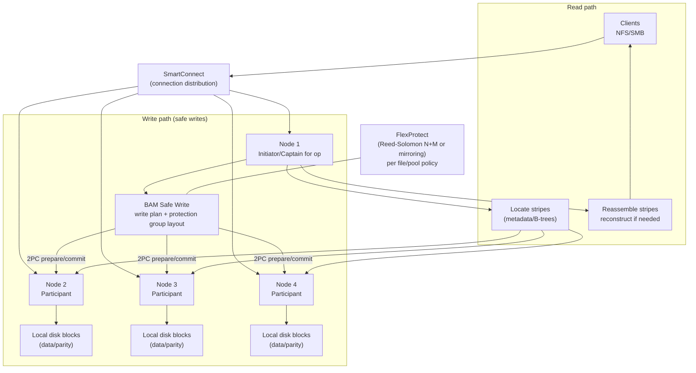

# Dell PowerScale (Isilon OneFS): Architectural Design Detail

PowerScale (Isilon) runs **OneFS**, a scale-out distributed filesystem where **every node is a peer** and files are striped and protected across the cluster. The key architectural characteristics are:
* **client connects to any node** (SmartConnect), which becomes the “captain” for the operation,
* writes are coordinated across multiple nodes using **safe write transactions** (2-phase commit),
* data protection is applied at the **file level** using **FlexProtect** (Reed-Solomon erasure coding \(N+M\)) or mirroring.

---

## 1. System Overview
* **Target Use Case:** Scale-out NAS for large unstructured datasets (home directories, media, analytics, backup repositories, AI pipelines).
* **Deployment Model:** Cluster of nodes; add nodes to scale capacity and throughput.
* **Storage Types:** File (NFS/SMB); internally a single filesystem namespace.

---

## 2. System Hierarchy (Where Things Run)
* **Client Layer**
    * NFS/SMB clients connect through a virtual name/IP layer.
* **Access + Connection Management**
    * **SmartConnect** distributes client connections across nodes; supports failover behaviors.
* **OneFS Distributed Filesystem Layer**
    * Each node runs the same OneFS stack.
    * A node’s I/O stack is often modeled as:
        * **Initiator (“captain”)**: orchestrates layout and transaction
        * **Participants**: own target stripes/blocks on their local disks
* **Protection + Layout Layer**
    * **Protection groups**: atomic units combining data + parity/mirrors.
    * **FlexProtect**: erasure coding layouts \(N+M\) applied per file/directory/pool.
* **Physical Layer**
    * Node-local disks/SSDs and a back-end cluster network used to stripe and coordinate I/O.

---

## 🖼 Architecture Diagram (Hierarchy + Datapath)

---

## 3. Core Components

### 3.1 SmartConnect (client attachment)
* Distributes client connections across the cluster at the front-end Ethernet layer.
* Supports failover behaviors so clients can continue operations when nodes are taken down or fail (protocol-dependent behavior).

### 3.2 “Captain” model + safe writes
* The node a client is attached to becomes the **captain** for reads/writes on that operation/file.
* For **write coherency**, OneFS establishes a transaction and uses **2-phase commit (2PC)** to atomically update blocks across the participant nodes/disks for the protection group.

### 3.3 FlexProtect (file-level erasure coding)
* **Protection groups**
    * Files are divided into stripe units (commonly discussed as 128KiB stripe units in OneFS literature) and organized into protection groups.
* **Erasure coding**
    * OneFS uses Reed-Solomon style \(N+M\) protection; parity is distributed across nodes (no dedicated parity disks).
* **Metadata protection**
    * Inodes/directories/metadata are protected at the same or higher level than the data they reference (commonly via mirroring).

---

## 4. Data Path & Write/Read Flow

### 4.1 Write Path (high-level)
* **Step 1 — Client connects**
    * SmartConnect directs the client to a node; that node acts as the captain for the write.
* **Step 2 — Layout decision**
    * Captain computes the file layout and selects a protection group based on current policy and available stripe width.
* **Step 3 — Transaction (2PC)**
    * Captain executes a safe write transaction across participant nodes (prepare/commit).
    * Participants journal/commit their part of the protection group locally.
* **Step 4 — ACK**
    * Once the transaction commits across the protection group, the write is acknowledged.

### 4.2 Read Path (high-level)
* **Step 1 — Captain lookup**
    * Captain uses metadata structures to identify which nodes hold the needed stripes.
* **Step 2 — Parallel fetch**
    * Captain fetches stripe units from participants in parallel over the back-end network.
* **Step 3 — Reassembly / reconstruction**
    * Data is reassembled for the client; missing stripes can be reconstructed from parity per \(N+M\).

---

## 5. Resiliency & Rebuild
* **Failure domains**
    * A “failure” can be a disk, a node, or broader component depending on policy.
* **Rebuild behavior**
    * FlexProtect rebuilds only what is affected (file-level) and parallelizes reconstruction across nodes.
* **Protection level vs policy**
    * The configured policy can be higher than what the current cluster size can satisfy; the achieved protection level depends on writable node count and layout feasibility.

---

## 6. Integration Points
* **Protocols:** NFS, SMB
* **Client connectivity:** SmartConnect (DNS-based connection distribution)
* **Operational tooling:** per-file/per-directory protection policies, pools/tiering (architecture-level knobs that affect layout)

---

### Reference Links (Technical)
* [PowerScale OneFS: Technical Overview (captain model, SmartConnect, FlexProtect)](https://www.delltechnologies.com/asset/sv-se/products/storage/industry-market/h10719-wp-powerscale-onefs-technical-overview.pdf)
* [High Availability and Data Protection with PowerScale (2PC safe writes, protection groups)](https://www.delltechnologies.com/asset/nl-nl/products/storage/industry-market/h10588-wp-powerscale-onefs-data-protection.pdf)
* [OneFS writes (initiator/participant model and write coalescing)](https://infohub.delltechnologies.com/en-us/p/onefs-writes/)

