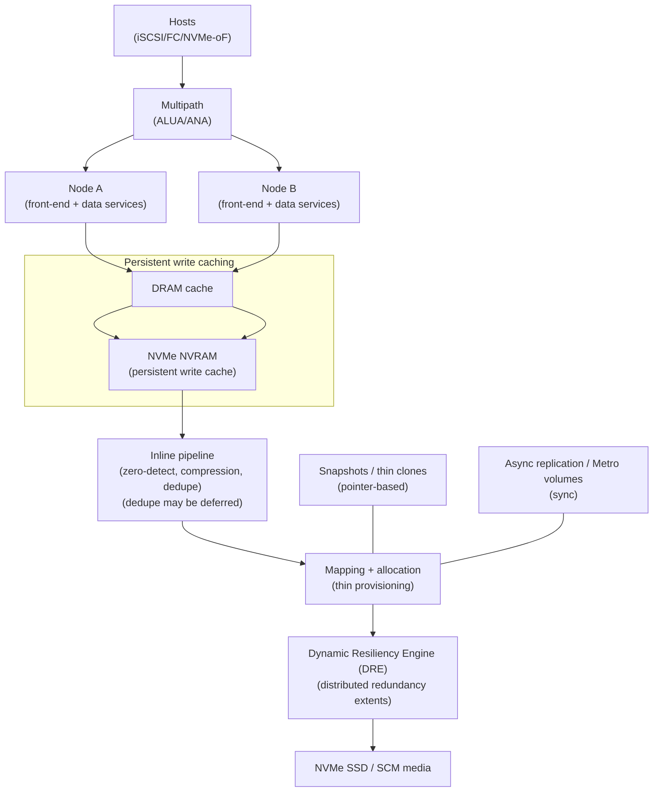

# Dell PowerStore: Architectural Design Detail

PowerStore is a modern NVMe-based storage platform built around a **dual-node, active/active architecture** and a software-defined data services stack. From an architectural perspective, the defining elements are:
* **persistent write caching** (DRAM → NVMe NVRAM) to acknowledge writes safely at low latency,
* a software-based protection scheme (**Dynamic Resiliency Engine (DRE)**) that distributes redundancy across drives, and
* inline (and sometimes deferred) **data reduction** integrated into the write pipeline.

---

## 1. System Overview
* **Target Use Case:** Enterprise block and file storage for virtualized and bare-metal workloads; predictable HA and data services.
* **Deployment Model:** Appliance with two nodes (controllers) forming an active/active pair; scale via clustering (multiple appliances).
* **Storage Types:** Block (volumes/volume groups) and file (NAS resources), depending on software version/features enabled.

---

## 2. System Hierarchy (Where Things Run)
* **Client / Host Layer**
    * Hosts access storage via **iSCSI/FC** (SCSI) or **NVMe-oF** (NVMe/FC, NVMe/TCP) for block; and NAS protocols for file.
* **Front-End + Multipath Layer**
    * Multipathing with asymmetric access models (ALUA/ANA), but the array is designed to commit I/O without disruptive “trespass” behavior.
* **Controller / Data Services Layer**
    * Two active nodes run a microservices-based data services stack (protocol front-end, caching, mapping, reduction, snapshots, replication).
* **Persistence + Protection Layer**
    * **DRAM cache** + **NVMe NVRAM** for persistent write cache (model-dependent)
    * **DRE** for redundancy extents and rebuild distribution across drives
* **Media Layer**
    * NVMe SSD and optional SCM (storage-class memory) tiers; SCM can accelerate metadata or serve as data tier in all-SCM configs.

---

## 🖼 Architecture Diagram (Hierarchy + Datapath)

---

## 3. Core Components

### 3.1 Persistent write caching (why writes can ACK early)
* **Write staging**
    * Incoming writes are staged in **DRAM**, then persisted to **NVMe NVRAM** (on models that include it).
* **Durability boundary**
    * The platform can acknowledge the host once the write is safe in the persistent cache (and/or otherwise protected, depending on model).
* **Power-loss behavior**
    * NVRAM devices are designed to preserve cached writes by vaulting to persistent flash storage on power events (implementation detail varies by model).

### 3.2 DRE (Dynamic Resiliency Engine)
* **Architectural role**
    * Provides redundancy comparable to RAID-style parity, but distributes “redundancy extents” across many drives.
* **Rebuild characteristics**
    * Because protection is distributed, rebuild work can be parallelized across the drive set rather than constrained to a narrow RAID group.

### 3.3 Thin provisioning + snapshots/clones
* **Thin mapping**
    * Logical volumes map to physical allocations; metadata is central to fast snapshot/clone creation.
* **Snapshots**
    * Implemented as space-efficient point-in-time views (pointer-based), with copy-on-write/redirect-on-write semantics behind the scenes.

---

## 4. Data Path & Write/Read Flow

### 4.1 Write Path (simplified)
* **Step 1 — Host I/O arrives**
    * I/O enters via front-end ports and multipath.
* **Step 2 — Cache + persistence**
    * Data is staged in DRAM and persisted into NVRAM-backed write cache (where applicable).
* **Step 3 — Data services pipeline**
    * Inline reduction (compression/dedupe) is applied; the system may defer some dedupe work during peak load to preserve latency.
* **Step 4 — Allocation + protection**
    * The mapping layer allocates physical space and DRE generates/parities redundancy extents.
* **Step 5 — Media write**
    * Protected data is written to NVMe SSD/SCM media.

### 4.2 Read Path (simplified)
* **Step 1 — Lookup**
    * Mapping metadata is consulted to locate physical blocks.
* **Step 2 — Cache / media**
    * Reads may be served from cache; otherwise fetched from media.
* **Step 3 — Decompression / rehydration**
    * Reduced data is reconstructed for the host as needed.

---

## 5. Resiliency & High Availability
* **Active/active access**
    * Host paths can remain online without disruptive ownership moves; failover is designed to preserve I/O continuity.
* **Drive failures**
    * DRE maintains redundancy and orchestrates rebuild across the device set.
* **Metro / synchronous replication (where used)**
    * Metro volumes provide synchronous replication across two clusters at metro distance for certain block use cases (architecture: two-site active/active).

---

## 6. Integration Points
* **Block protocols:** iSCSI, FC, NVMe/FC, NVMe/TCP
* **VMware integration:** multipathing behaviors, vVol/VASA (platform-dependent)
* **Replication/DR:** native asynchronous replication; metro patterns for synchronous use cases

---

### Reference Links (Technical)
* [PowerStore: Clustering and High Availability (active/active, ALUA/ANA, DRE, metro volumes)](https://www.delltechnologies.com/asset/en-us/products/storage/industry-market/h18157-dell-powerstore-clustering-high-availability.pdf)
* [PowerStore: Introduction to the Platform (NVMe NVRAM roles, hardware + caching)](https://www.delltechnologies.com/asset/en-us/products/storage/industry-market/h18149-dell-powerstore-platform-introduction.pdf)
* [PowerStore Best Practices Guide (NVRAM caching, SCM metadata tiering, data reduction behaviors)](https://www.delltechnologies.com/asset/en-us/products/storage/industry-market/h18241-dell-powerstore-best-practices-guide.pdf)

