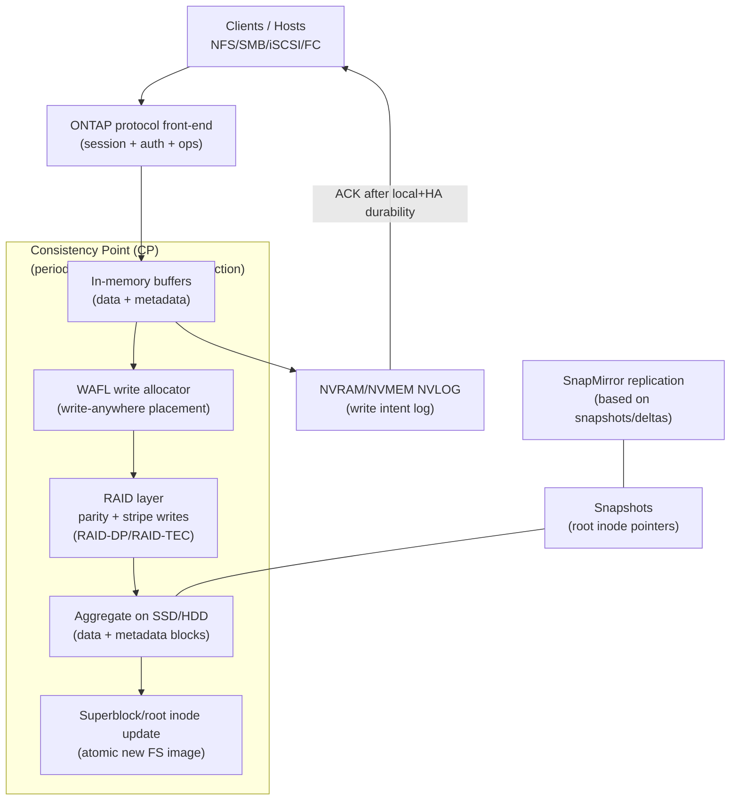

# NetApp ONTAP (AFF/FAS + WAFL): Architectural Design Detail

ONTAP is NetApp’s storage operating system for NAS/SAN platforms (AFF/FAS) built around **WAFL (Write Anywhere File Layout)**. Architecturally, ONTAP is defined by a **log-protected, memory-first write pipeline** and periodic filesystem transactions called **Consistency Points (CPs)** that atomically persist a self-consistent on-disk image.

This document is intentionally technical (design + workflows), focusing on **system hierarchy, core components, data path, and resiliency mechanisms**.

---

## 1. System Overview
* **Target Use Case:** Enterprise NAS (NFS/SMB) and SAN (iSCSI/FC) with snapshots, replication, multi-protocol, and predictable recovery semantics.
* **Deployment Model:** Dual-controller HA pairs and/or clustered scale-out ONTAP (data SVMs/volumes across nodes).
* **Storage Types:** File + Block (and associated metadata services), implemented on WAFL aggregates.

---

## 2. System Hierarchy (Where Things Run)
* **Client / Host Layer**
    * Applications issuing reads/writes over **NFS/SMB** (file) or **iSCSI/FC** (block LUNs).
* **ONTAP Controller Layer**
    * Front-end protocol processing, caching, WAFL filesystem logic, RAID/parity, snapshot/replication orchestration.
* **Persistence + Protection Layer**
    * **NVRAM/NVMEM (NVLOG)** for write intent/durability logging
    * **System memory buffers** (data + metadata to be committed at CP)
    * **WAFL aggregates** built on RAID groups (RAID-DP / RAID-TEC)
* **Physical Device Layer**
    * SSD/HDD media; parity layout and stripe management performed by ONTAP RAID layer.

---

## 🖼 Architecture Diagram (Hierarchy + Datapath)

---

## 3. Core Architecture & Components

### 3.1 Control Plane vs Data Plane
* **Control Plane**
    * Cluster configuration, volume/LIF placement, policy management, snapshot schedules, replication relationships.
* **Data Plane**
    * Protocol processing + caching + WAFL + RAID I/O execution.

### 3.2 WAFL: Transactional, Write-Anywhere Layout
* **Write-anywhere allocation**
    * Modified blocks are written to **new locations**; metadata pointers are updated to reference the new blocks.
    * This avoids classic in-place “read-modify-write” patterns and aligns well with RAID stripe writing.
* **Metadata-as-files**
    * WAFL stores metadata structures as files, making metadata flushing part of normal CP cleaning.
* **Atomic persistence via CP**
    * A CP isolates the set of dirty buffers to be persisted, writes them out, then **atomically commits** the new on-disk image by updating the superblock/root inode pointers.

### 3.3 NVLOG (NVRAM/NVMEM): Durability Before Disk
* **Purpose**
    * NVLOG is a **redo log** of recent write operations that have been acknowledged but not yet made durable on disk by a CP.
* **Failure role**
    * On an unclean shutdown, NVLOG replays to reconstruct in-memory state so it can be persisted by subsequent CP operations.
* **HA mirroring (architectural concept)**
    * In HA designs, write intent is protected across the HA pair so the system can safely ACK before CP completes.

### 3.4 RAID-DP / RAID-TEC: Data Protection at the Aggregate Layer
* **RAID-DP**
    * Dual-parity protection within RAID groups (conceptually similar to RAID-6).
* **RAID-TEC**
    * Triple-parity protection for higher failure tolerance (at higher parity overhead).
* **Why it matters in the datapath**
    * CP batching + write coalescing increases the probability of **full-stripe writes**, reducing parity read overhead.

---

## 4. Data Path & Write/Read Flow

### 4.1 Write Path (from host to durable media)
* **Step 1 — Protocol receive**
    * Client issues a write (file op or block write); ONTAP processes protocol semantics and buffers data in memory.
* **Step 2 — Durability log (NVLOG)**
    * The write intent is logged to **NVRAM/NVMEM** (and protected per HA policy).
* **Step 3 — ACK**
    * Once NVLOG durability criteria are satisfied, the system acknowledges the write to the client.
* **Step 4 — Consistency Point (CP) persists to disk**
    * Periodically (or when thresholds trigger), ONTAP:
        * freezes a set of dirty buffers for the CP
        * performs WAFL write allocation (write-anywhere placement)
        * issues RAID stripe writes with parity
        * commits the new on-disk image (superblock/root inode update)
* **Step 5 — NVLOG truncation**
    * After CP persistence, the corresponding write intents can be removed from NVLOG.

### 4.2 Read Path
* **Step 1 — Cache lookup**
    * Serve from controller cache when present (recent writes and hot reads).
* **Step 2 — WAFL metadata traversal**
    * On miss, WAFL traverses metadata structures to locate physical blocks.
* **Step 3 — RAID mapping + device read**
    * RAID layer maps logical blocks to device locations, reads data, validates checksums, returns to the client.

### 4.3 Consistency model (practical)
* **Crash consistency**
    * CP defines a self-consistent on-disk image; NVLOG enables recovery of acknowledged writes after failures.
* **Snapshot consistency**
    * Snapshot creation is metadata-driven (root inode pointer operations), producing consistent point-in-time views.

---

## 5. Resiliency & Data Integrity
* **Controller / power failure**
    * NVLOG enables recovery of acknowledged-but-not-yet-CP-persisted writes.
* **Disk failure**
    * RAID-DP/TEC tolerates disk failures per parity level; reconstruction is performed from remaining stripes.
* **Bit rot / corruption**
    * Checksums on blocks enable detection; reconstruction/repair uses parity/mirrors where possible.

---

## 6. Integration Points
* **Protocols**
    * **NFS/SMB** for NAS, **iSCSI/FC** for SAN.
* **Snapshots & replication**
    * Snapshot lineage acts as the basis for efficient replication workflows (e.g., shipping deltas between snapshot points).
* **Ecosystem**
    * Backup and DR tooling commonly integrates by orchestrating snapshot creation and transferring snapshot-based data.

---

### Reference Links (Technical)
* [NetApp WAFL paper (Consistency Points, inode cleaning, write allocation)](https://www.netapp.com/media/23892-sw-WAFL.pdf)
* [How ONTAP caches and writes (NVRAM + CP workflow explanation)](https://bitpushr.wordpress.com/2014/07/28/how-data-ontap-caches-assembles-and-writes-data/)

