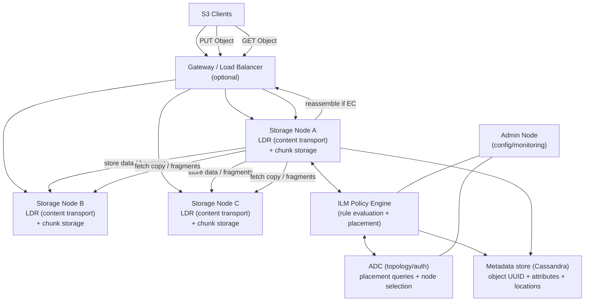

# NetApp StorageGRID: Architectural Design Detail (Object + ILM)

NetApp StorageGRID is an S3-centric object storage platform built as a **grid of nodes**. Architecturally, it is defined by:
* a **policy engine (ILM)** that decides *how objects are protected and where they live over time*, and
* a **distributed metadata store** that tracks object locations and supports placement decisions and retrieval.

This document focuses on technical architecture: **system hierarchy, node/services, ingest/retrieve datapaths, replication vs erasure coding**, and key integration points.

---

## 1. System Overview
* **Target Use Case:** S3 object storage for on-prem / multi-site environments, archival tiers, and regulated retention with policy-driven placement.
* **Deployment Model:** Multi-node grid spanning one or more sites (failure domains).
* **Storage Types:** Object storage (S3; Swift historically), with metadata-managed placement and protection.

---

## 2. System Hierarchy (Where Things Run)
* **Client Layer**
    * S3 applications (PUT/GET/HEAD, multipart uploads, lifecycle at the bucket/app layer).
* **Access Layer**
    * **Gateway Nodes** (optional): load balancing / endpoint access, routing to storage services.
* **Storage Layer**
    * **Storage Nodes**: host the core services that store objects, move data, and maintain metadata.
* **Control / Management Layer**
    * **Admin Nodes**: management, monitoring, and configuration of the grid.
* **Physical Layer**
    * Node-local storage (object data + metadata volumes), plus the grid network linking sites/nodes.

---

## 🖼 Architecture Diagram (Hierarchy + Datapath)

---

## 3. Core Architecture & Components

### 3.1 ILM (Information Lifecycle Management)
* **What ILM controls**
    * Which objects match which rules (tenant/bucket/metadata filters)
    * **Protection method:** replication vs erasure coding
    * **Placement:** which sites/storage pools hold copies/fragments
    * **Ingest behavior:** whether placement is satisfied synchronously at ingest time vs staged behaviors
    * **Retention/time-based movement:** how placement can change as objects age
* **Design implication**
    * Data placement is not an afterthought; it is a first-class *policy-driven dataplane behavior*.

### 3.2 Storage Nodes and “content transport” services
* **LDR (content transport / content routing)**
    * Handles data storage, transfers between nodes, and much of the request handling for object data movement.
    * Executes ILM-directed replication/EC workflows (as orchestrated by ILM logic).
* **ADC (topology + authentication)**
    * Provides topology information used during placement decisions (selecting best sources/destinations).
* **DDS + Cassandra metadata**
    * Stores and serves **object metadata** (object identifiers, attributes, and location pointers).
    * Object metadata is protected by maintaining multiple copies per site (implementation detail varies by version).

---

## 4. Data Path & Object Lifecycle Flows

### 4.1 Ingest / Write Path (PUT)
* **Step 1 — Client sends PUT**
    * Request enters via Gateway (or directly to a Storage Node endpoint depending on deployment).
* **Step 2 — ILM evaluation**
    * Object is evaluated against the ordered ILM rules in the active policy.
* **Step 3 — Protection method execution**
    * **Replication path**
        * System creates **N exact copies** and places them to the specified storage pools/sites.
    * **Erasure coding (EC) path**
        * Object is sliced into **data fragments** and **parity fragments** (e.g., 4+2) and distributed across nodes/sites per the EC profile.
* **Step 4 — Metadata update**
    * Metadata store is updated with object location pointers for each copy/fragment set.

### 4.2 Retrieve / Read Path (GET)
* **Step 1 — Locate**
    * Serving node queries the metadata store to locate eligible copies/fragments.
* **Step 2 — Fetch**
    * For replication: fetch a full copy from a suitable node/site.
    * For EC: fetch required fragments from multiple nodes and **reconstruct** the object.
* **Step 3 — Serve**
    * Object is streamed back to the client; missing/corrupt fragments can be rebuilt (subject to EC scheme).

### 4.3 Background ILM compliance
* ILM rules are periodically re-evaluated to ensure objects remain compliant:
    * re-copy / re-EC if a node/site is lost
    * migrate placement as policy/time windows require

---

## 5. Resiliency & Data Integrity
* **Replication**
    * Tolerates loss of a copy location (node/site) as long as at least one copy remains accessible; system recreates missing copies to restore the target count.
* **Erasure coding**
    * Tolerates loss/corruption of up to \(M\) fragments in an \(N+M\) scheme; reconstructs missing fragments and re-protects per policy.
* **Metadata durability**
    * Metadata store is replicated; loss of metadata quorum is a control-plane/data-location risk and is designed to be avoided through per-site sizing.

---

## 6. Integration Points
* **S3 API**
    * Primary integration surface for apps and S3-compatible tooling.
* **Cloud Storage Pools**
    * ILM can target external object stores (S3/Azure Blob) as a tier, treating them as placement destinations.
* **Multi-site design**
    * ILM placement can explicitly encode site-level survivability (e.g., 2 sites with replicated copies; 3 sites with EC).

---

### Reference Links (Technical)
* [How StorageGRID manages data (replication vs EC; metadata tracks locations)](https://docs.netapp.com/us-en/storagegrid-116/primer/how-storagegrid-manages-data.html)
* [Information lifecycle management (ILM) concepts and ingest behavior](https://docs.netapp.com/us-en/storagegrid/primer/using-information-lifecycle-management.html)
* [Copy management workflow details (LDR/ADC/DDS interactions)](https://docs.netapp.com/us-en/storagegrid/primer/copy-management.html)
* [Grid nodes and services (ADC/DDS/LDR roles)](https://docs.netapp.com/us-en/storagegrid-119/primer/nodes-and-services.html)

