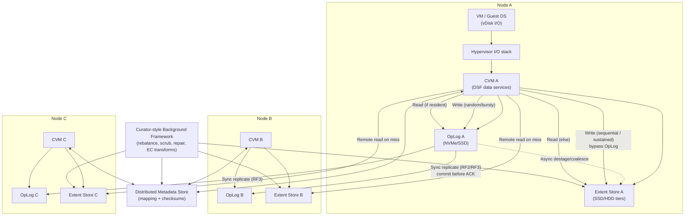

# Nutanix AOS (DSF/NDFS): Architectural Design Detail

Nutanix AOS (Acropolis Operating System) provides a distributed storage system (historically “NDFS”, now commonly described as **Distributed Storage Fabric (DSF)**) tightly integrated with a hypervisor cluster. The core architectural idea is **a per-node Controller VM (CVM)** that runs the storage control/data services and uses local devices (NVMe/SSD/HDD) plus the cluster network to present resilient shared storage.

This document focuses on **architecture, workflows, and datapaths** (not product positioning): system hierarchy, CVM roles, read/write flows, replication factor (RF), failure handling, and integration points.

---

## 1. System Overview
* **Target Use Case:** General-purpose virtualization storage (HCI), mixed OLTP + enterprise workloads, and platform storage for Nutanix services.
* **Deployment Model:** Scale-out cluster of nodes; each node runs a hypervisor + a **CVM**. Storage devices are consumed by DSF.
* **Storage Types (at DSF core):** Primarily **block-style virtual disks** consumed by VMs; higher-level services can expose file/object, but this doc centers on the DSF dataplane used by VM I/O.
* **Primary Design Goals (technical):**
    * **Linear scale-out** by adding nodes/devices.
    * **No dedicated storage head**: every node participates in metadata and data services.
    * **Locality-aware I/O**: prefer local servicing of reads/writes while maintaining RF across fault domains.

---

## 2. System Hierarchy (Where Things Run)
* **Client / Workload Layer**
    * **VM guest OS + applications** issuing reads/writes to a virtual disk (vDisk).
* **Compute / Hypervisor Layer**
    * Hypervisor datapath translates guest I/O to a storage protocol or paravirtual interface (varies by hypervisor and configuration).
* **Per-Node Storage Services Layer**
    * **CVM (Controller VM)** on every node runs DSF services that implement:
        * I/O handling (front-end request processing, placement, RF enforcement)
        * Distributed metadata services
        * Background lifecycle services (rebalance, scrub, EC transforms, rebuild)
* **Distributed Storage Fabric Layer**
    * **OpLog** (persistent write buffer / staging journal on performance tier)
    * **Extent Store** (persistent bulk storage spanning device tiers)
    * **Metadata store** (distributed, replicated) mapping vDisks → extents/extent-groups → replica locations + checksums + state
* **Physical Layer**
    * **Performance tier**: NVMe/SSD
    * **Capacity tier**: SSD/HDD (depending on platform)
    * **Cluster network**: carries synchronous replication traffic, remote reads, rebuild, and background movement

---

## 🖼 Architecture Diagram (Hierarchy + Datapath)

---

## 3. Core Architecture & Components

### 3.1 Control Plane vs Data Plane
* **Control Plane (cluster + lifecycle)**
    * Cluster membership, configuration, upgrades, health, and coordination.
    * Management plane surfaces (e.g., Prism UI / APIs) interact with distributed services rather than a single storage controller.
* **Data Plane (I/O path)**
    * Per-node CVM services accept VM I/O, classify it, place it across nodes/devices, enforce durability (RF), and serve reads with locality.

### 3.2 CVM: The “Storage Controller per Node”
* **Key idea:** each node contributes one CVM; collectively they form a distributed storage system.
* **CVM responsibilities (architectural)**
    * **I/O request processing**: receive VM I/O, apply write characterization, choose placement targets, and coordinate replication.
    * **Durability enforcement**: ensure writes meet the configured **replication factor (RF)** before acknowledging to the VM/hypervisor.
    * **Caching and locality**: serve reads locally when possible; fetch remotely when required.
    * **Background tasks**: destage/coalesce, scrubbing, re-replication, balancing, and (optionally) erasure coding transforms.

### 3.3 Storage Primitives (Mental Model)
* **OpLog**
    * **Role:** low-latency persistent staging area for *bursty random writes*.
    * **Placement:** stored on the performance tier (NVMe/SSD).
    * **Durability:** synchronously replicated to other CVMs’ OpLogs according to RF before ACK.
* **Extent Store**
    * **Role:** long-lived persistent data store spanning tiers (SSD/HDD, or all-flash).
    * **Ingest paths:** data arrives either by **drain/destage from OpLog** or **direct writes** (e.g., sequential/sustained patterns).
* **Metadata store (distributed)**
    * **Role:** maps logical objects (vDisks) to physical extents/replicas and stores checksums/state.
    * **Property:** distributed + replicated to avoid a single metadata head; supports strict consistency semantics for metadata operations.
* **Curator-style background framework (MapReduce-like)**
    * **Role:** cluster-wide scans and distributed tasks for cleanup, scrubbing, rebuild planning, balancing, and post-process transforms (e.g., EC).

---

## 4. Data Path & Write/Read Flow

### 4.1 Write Path (RF-aware durability)
At a high level, a VM write is processed by the **local node’s CVM** whenever possible, then replicated across peers to satisfy RF.

* **Step 1 — VM issues a write**
    * Guest writes to vDisk; hypervisor forwards to the DSF datapath for the cluster.
* **Step 2 — CVM receives and classifies the write**
    * A write-characterizer classifies I/O (random vs sequential, bursty vs sustained) to choose:
        * **OpLog path** (bursty random)
        * **Direct-to-Extent-Store path** (sequential and/or sustained patterns)
* **Step 3 — Synchronous replication to meet RF**
    * For the **OpLog path**, the local CVM persists the write to its local OpLog and **synchronously replicates** it to remote CVM OpLogs:
        * **RF2:** local + 1 remote replica must be committed before ACK
        * **RF3:** local + 2 remote replicas must be committed before ACK
    * Replica targets are selected across nodes (and ideally across fault domains like blocks/racks) to avoid correlated failures.
* **Step 4 — Acknowledgement**
    * Only after the RF durability condition is met does the system ACK the write back up the stack.
* **Step 5 — Destage / coalesce (asynchronous)**
    * OpLog data is **coalesced** and **drained** to the extent store to:
        * reduce random-write amplification on capacity media
        * convert small random updates into more sequential writes
        * preserve RF in the persistent extent layout

### 4.2 Read Path (local-first with remote fallback)
* **Step 1 — Read request enters the CVM datapath**
    * A read request is handled by the local CVM when available.
* **Step 2 — Determine where the freshest copy lives**
    * If the data is still resident in **OpLog** (not yet drained), reads are fulfilled from OpLog.
    * Otherwise reads are served from the **extent store** (potentially via cache/tiered placement).
* **Step 3 — Locality optimization**
    * **Local read:** if a local replica exists (or the needed extent is local), serve from local devices.
    * **Remote read:** if the local node does not have the needed replica, fetch from the appropriate replica location over the cluster network.
* **Step 4 — Read integrity**
    * Checksums associated with extents enable detection of corruption; if a bad replica is detected, the system can fall back to another replica and schedule repair.

### 4.3 What Actually Makes RF “Real” on Disk
* **In OpLog:** RF is explicit because every write must be durably present in N CVMs’ OpLogs before ACK.
* **In Extent Store:** RF is maintained by storing replicas of extent/extent-groups across nodes/devices; background services ensure RF is re-established after failures or topology changes.

---

## 5. Replication Factor (RF), Fault Tolerance, and Failure Handling

### 5.1 RF levels (conceptual)
* **RF2 (often aligned with “FT1”)**
    * **Data copies:** 2
    * **Failure tolerance:** tolerate loss of 1 replica location (node/disk depending on placement)
    * **Tradeoff:** lower network + capacity overhead than RF3; less tolerant of correlated failures
* **RF3 (often aligned with “FT2”)**
    * **Data copies:** 3
    * **Failure tolerance:** tolerate loss of 2 replica locations (under correct placement)
    * **Tradeoff:** higher overhead; higher write replication fanout; stronger availability in multi-failure scenarios

### 5.2 Node failure vs CVM/service failure (datapath impact)
* **Local CVM down (node still up)**
    * Hypervisor I/O is **re-routed to a remote CVM** (auto-pathing concept) so VMs can continue issuing I/O.
    * Reads/writes may become **network-bound** because the local “storage controller” is unavailable.
* **Node down**
    * Replicas on that node are unavailable; RF may temporarily degrade.
    * Background services schedule **re-replication** to restore RF using surviving replicas.

### 5.3 Disk failure (data protection workflow)
* **Detection**
    * Device errors and checksum failures signal data risk and trigger repair workflows.
* **Planning**
    * A curator-style scan consults metadata to identify extents/extent-groups impacted by the failed disk.
* **Repair**
    * Data is reconstructed from remaining replicas and written to new locations to restore RF.
    * Repair is typically throttled to limit impact on foreground latency.

### 5.4 Network partitions and consistency (architectural stance)
* **Metadata correctness requires strict coordination**
    * Cluster membership/leadership and metadata operations must avoid split brain.
    * Operationally, the system must prefer **safety over availability** for control/metadata changes under uncertain partitions.
* **Data availability under partition**
    * Reads can be served from available replicas; writes must still meet RF durability rules (which can be constrained by partition topology).

---

## 6. Scalability & Performance (Design-Level)

### 6.1 Scale-out mechanics
* **Add nodes → add CVMs + devices**
    * Capacity and aggregate throughput scale with node count.
* **Rebalancing**
    * Background movement redistributes data and metadata to incorporate new devices/nodes and reduce skew.

### 6.2 Performance levers (architectural)
* **Random write absorption via OpLog**
    * Converts bursty random writes into sequential destage traffic.
* **Tiering / ILM-like placement**
    * Hot data gravitates to faster tiers; colder data can sit on capacity tiers.
* **Locality**
    * Prefer local servicing; remote I/O increases tail latency and consumes fabric bandwidth.

### 6.3 Common architectural bottlenecks to evaluate
* **Network fabric**
    * RF replication fanout and rebuild traffic can saturate links; expect increased latency under degraded modes.
* **Small-write amplification**
    * Coalesce/destage mitigates, but sustained small random writes can pressure OpLog and metadata.
* **Rebuild storms**
    * Multiple failures or simultaneous maintenance can trigger heavy re-replication; rate limiting matters to protect foreground QoS.

---

## 7. Integration Points (Ecosystem)

### 7.1 Hypervisor integration (datapath attachment)
* **VM storage presentation**
    * VMs consume storage as vDisks; the hypervisor forwards I/O into the DSF datapath.
* **Failure behavior**
    * When a local CVM is unavailable, the hypervisor can redirect I/O to another CVM (transparent to the guest).

### 7.2 Kubernetes integration (optional layering on top)
* **CSI drivers**
    * A CSI layer can translate Kubernetes `PersistentVolume` lifecycle operations into DSF volume operations (provision, attach, snapshot/clone where supported).
* **Operational coupling**
    * Storage policies (RF, performance characteristics) map naturally into StorageClasses and platform policy constructs.

### 7.3 Data protection / DR (conceptual)
* **Snapshots / clones**
    * Typically implemented as metadata-driven mechanisms with copy-on-write semantics at the extent/extent-group level.
* **Asynchronous replication**
    * Change tracking + shipping deltas to a remote site; RPO depends on schedule and bandwidth.
* **Metro patterns**
    * Stretch/active-active patterns require careful quorum/failure-domain design; RF and witness/coordination are central.

---

## 8. Field Validation Checklist (Architectural, Not Marketing)
When evaluating or troubleshooting, these are the “architecture truths” worth verifying on a real cluster.

* **RF and placement**
    * Confirm RF is set per storage policy/container and that replica placement spans intended fault domains (blocks/racks).
* **Write behavior**
    * Validate what fraction of writes hit OpLog vs bypass to extent store under your workload (randomness/sequentiality).
* **Degraded-mode behavior**
    * Observe latency and throughput when a CVM is down (auto-pathing) vs a full node is down (rebuild pressure).
* **Rebuild throttling**
    * Ensure rebuild/curation doesn’t collapse foreground QoS during maintenance windows.

---

### Reference Links (Technical)
* [The Nutanix Cloud Bible — AOS Storage (DSF datapath, OpLog, Extent Store, RF)](https://www.nutanixbible.com/4c-book-of-aos-storage.html)
* [The Nutanix Cloud Bible — Cluster Components (Stargate/Cassandra/Curator roles)](https://www.nutanixbible.com/2f-book-of-basics-cluster-components.html)
* [The Nutanix Cloud Bible — Drive Breakdown (metadata + OpLog sizing and device usage)](https://www.nutanixbible.com/2i-book-of-basics-drive-breakdown.html)
* [Nutanix Community thread — CVM down auto-pathing behavior + OpLog notes (operational datapath details)](https://next.nutanix.com/how-it-works-22/data-rebuild-when-cvm-is-down-and-oplog-question-37706?postid=51528)

