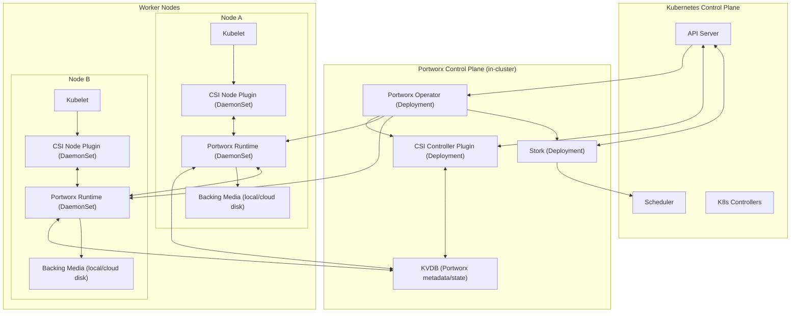

# Portworx Reference Architecture (Kubernetes-native)

This document is a **reference architecture** view of Portworx on Kubernetes—focused on **components**, **Kubernetes primitives**, and **request/data flow**. It intentionally avoids deep code-level details.

---

### Scope and repo anchors (where the pieces live)
- **Operator / lifecycle**
  - `libopenstorage/operator`
- **Orchestration layer**
  - `libopenstorage/stork`
- **Client tooling**
  - `portworx/pxc` (pxctl-style tooling)
- **Deployment packaging**
  - `portworx/helm`
- **Control APIs lineage**
  - `libopenstorage/openstorage`
- **Dev packaging**
  - `portworx/px-dev`

---

### Architectural layers (mental model)
- **Kubernetes control plane** (native)
  - API server, scheduler, controllers, etcd
  - CSI objects: `StorageClass`, `CSIDriver`, `VolumeSnapshotClass` (if used), PVC/PV
- **Portworx control plane**
  - Operator reconciliation + CSI controller control loops
  - Portworx cluster coordination backed by **KVDB**
- **Portworx data plane**
  - Portworx runtime on worker nodes provides IO services on backing media (local or cloud disks)
  - Replication, snapshots, encryption, policies executed at/near the node data path
- **Orchestration add-on (Stork)**
  - Storage-aware scheduling and higher-level stateful workflows

---

### Kubernetes primitives mapping (typical installation shape)
- **Operator**
  - **Deployment**: operator controller manager
  - **CRDs**: Portworx cluster custom resources (exact names vary by distribution/version)
  - **RBAC**: cluster roles for reconciliation and node/service management
- **Portworx runtime**
  - **DaemonSet**: privileged, host-integrated; runs on storage nodes
  - **Host access**: access to block devices, `/dev`, host networking as required by the runtime model
- **CSI Controller**
  - **Deployment**: controller plugin
  - **Sidecars (common CSI pattern)**: provisioner / attacher / resizer / snapshotter (as applicable)
- **CSI Node**
  - **DaemonSet**: node plugin per worker node consuming storage
- **Stork**
  - **Deployment**: stork controller(s)
  - **Scheduler extender / integration**: influences pod placement for data locality (implementation model depends on version/config)

---

### Boxes-and-arrows reference diagram

---

### End-to-end flow: PVC request → attached/mounted volume
- **1) Admin defines a `StorageClass`**
  - Contains Portworx-specific parameters (e.g., replication factor, fs type, encryption, performance profile) and allowed topologies.
- **2) App creates `PVC`**
  - Kubernetes binds the claim to a provisioned PV once provisioned.
- **3) CSI Controller provisions**
  - Watches for PVC needing provisioning and performs `CreateVolume` via Portworx control APIs.
  - Portworx consults **KVDB** to pick placement and establish replication set membership.
- **4) Portworx runtime materializes volume**
  - Allocates on backing media and sets up replication / policy enforcement.
  - Returns a volume handle to CSI; PV is created and bound to the PVC.
- **5) Pod scheduled**
  - Default scheduler places the pod based on constraints.
  - **Stork (if enabled for the workload)** can influence placement to favor nodes with data locality (replica present) and/or avoid hotspots.
- **6) CSI Node publishes**
  - When pod lands on a node, kubelet triggers CSI `NodeStageVolume` / `NodePublishVolume`.
  - CSI node plugin coordinates with Portworx runtime for attach/map and mount.
- **7) Application IO**
  - Writes flow from the pod → filesystem/block device → Portworx runtime → backing disks.
  - Replication propagates writes to peer nodes (subject to policy); reads prefer local replica when available.

---

### Control loops (who “reacts” to what)
- **Operator reconciliation loop**
  - **Input**: Portworx CR(s), Helm values, desired version/config.
  - **Output**: DaemonSets/Deployments/RBAC/Services updated; upgrades coordinated.
- **CSI control loops**
  - **Input**: PVC/PV/VolumeAttachment (and snapshots if configured).
  - **Output**: Portworx volumes created/expanded/deleted; node publish/unpublish invoked.
- **Stork orchestration loop**
  - **Input**: Stateful workload intents + storage policies + cluster topology.
  - **Output**: data-aware pod placement and orchestration workflows (migration/DR patterns).

---

### Cloud vs bare-metal integration points
- **Cloud (AWS/Azure/GCP)**
  - **Backing media**: provider block disks (performance and failure modes aligned to cloud disk primitives).
  - **Topology**: zones/regions influence placement; policies often align with AZ failure domains.
  - **Operations**: node replacement/autoscaling requires replica healing; the control plane uses KVDB-driven coordination to converge.
- **Bare metal / on-prem**
  - **Backing media**: direct-attached local disks or SAN LUNs.
  - **Topology**: racks/rows modeled as failure domains; networking is a primary performance lever (replication bandwidth/latency).
  - **Operations**: device adds/replacements and capacity growth are handled through Portworx runtime + operator workflows.

---

### How to use this doc
- Use `Readme.md` for the **high-level summary**.
- Use this `Arch_Readme.md` when you need a **single-page reference** of how the components fit together on Kubernetes.
